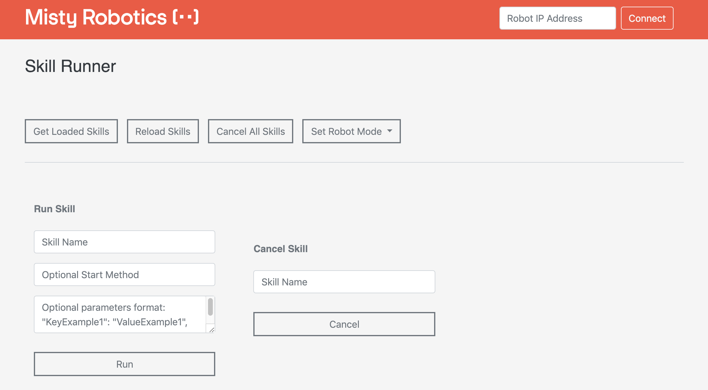
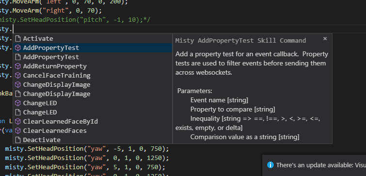

# {{title}}

## Loading & Running a Local Skill

Once you’ve created the files for your skill, you must load them onto your robot before you can run them. The two methods for loading skills onto Misty are:
* the Skill Runner tool (available as a ZIP archive; click `SkillRunner.html` to open), which provides a simple upload feature
* a REST tool such as Postman that can send a `POST` request to a dedicated endpoint for skill deployment

<!-- TODO: link to skill runner -->

### Using Skill Runner


<!-- TODO: Insert image of Skill Runner here -->

1. Compress and save your skill’s `Meta` and `Code` files into a .zip file with the same name as your skill.
2. Open `SkillRunner.html` and connect to Misty using your robot’s IP address.
3. Open up your browser’s JavaScript console for the Skiller Runner page, so you can see what’s happening.
4. Select **Upload Zip File** under “Save Skill to Robot.”
5. Select the .zip file you just created. Observe the JavaScript console for a success message confirming that the upload request was received.
6. Once the file has been uploaded to Misty, click **Reload Skills** at the top of the page. This ensures that your robot and latest code changes are in sync. Observe the JavaScript console for a log message verifying the skills have been loaded. 
7. To run your skill, enter the skill’s name under “Run Skill” and click **Run**. Continue observing the console; as events are triggered, you’ll see debug messages in the console. 

**Note:** You can generate useable `meta` file content with the Generate Meta Template controls in Skill Runner.

### Using Postman
There are many ways to send a `POST` request to the skill deployment endpoint, but here we’ll use Postman.

1. Compress and save your skill’s `Meta` and `Code` files into a .zip file with the same name as your skill.
2. To attach your skill .zip to the request, first navigate to the Headers section in Postman.
3. For the header key, enter “Content-Type”.
4. In the body section confirm that “form-data” is selected at the top.
5. For the header value, enter “multipart/form-data”.
6. For the body key, enter “skills”, then select “File” from the dropdown menu on the right.
7. In the body value section, click “Choose Files” and select the .zip file for your skill.
8. To add and load a skill onto the robot, send a POST request to `http://{your robot’s ip address}/api/alpha/sdk/skill/deploy` with the following parameters:
   * `Skill` (byte array) - A zipped file containing the two skill files (Meta and Code).
   * `ImmediatelyApply` (boolean) - `true` or `false`. Specifies whether the robot immediately runs the uploaded skill.
   * `OverwriteExisting` (boolean) - `True` or `False`. Indicates whether the file should overwrite a file with the same name, if one currently exists on this robot.
9. Look at the response to confirm the request was successful.
10. Open `SkillRunner.html` and connect to Misty using your robot’s IP address.
11. Open up your browser’s JavaScript console for the Skiller Runner page, so you can see what’s happening.
12. Click **Reload Skills** at the top of the page. This ensures that your robot and latest code changes are in sync. Observe the JavaScript console for a log message verifying the skills have been loaded.
13. To run your skill, enter the skill’s name under “Run Skill” and click **Run**. Continue observing the console; as events are triggered, you’ll see debug messages in the console.

## Starting & Stopping a Local Skill
Currently, local skills running on Misty I must be triggered to start/stop from an external command. This command can be sent via a REST client or as a JavaScript AJAX request.

To start a skill, send the `RunSkill POST` command with the following syntax. Note that the `Skill` value must be the same as the `Name` value for the skill in its JSON `meta` file.

```html
<!-- Endpoint -->
POST http://{robot-ip-address}/api/alpha/sdk/skill

<!-- Payload -->
{
    "Skill": "SkillName"
}
```

For example:

```html
<!-- Endpoint -->
POST http://{robot-ip-address}/api/alpha/sdk/skill

<!-- Payload -->
{
	"Skill": "Wander"
}
```

To stop a skill, send the `CancelSkill POST` command to the following endpoint, again using the Name value for the skill from its JSON `meta` file:

```html
<!-- Endpoint -->
POST http://{robot-ip-address}/api/alpha/sdk/cancel

<!-- Payload -->
{
	"Skill": "Wander"
}
```

To stop all running skills, send the same `POST` command with an empty payload (no skill name specified):

```html
<!-- Endpoint -->
POST http://{robot-ip-address}/api/alpha/sdk/cancel

<!-- Payload -->
{}
```

**Important!** Local skills are subject to a default timeout of 5 minutes. After 5 minutes the skill will cancel, even if it is performing actions or waiting on callbacks. This duration can be changed by providing a different `TimeoutInSeconds` value in the `meta` file. In addition, if a skill is not performing any actions nor waiting on any commands, it will automatically cancel after 5 seconds.

## Using the Local Skill Extension for Visual Studio Code

<!-- TODO: Download Link to VSC plugin -->

To aid in local skill development, we provide the MistySkills extension for [Visual Studio **Code**](https://code.visualstudio.com/). This extension provides a list of the available methods for local skills: 

As well as auto-complete, tabbed parameter entry, and information about each method:

To install the MistySkill extension, use the [Visual Studio Code Extensions Manager](https://code.visualstudio.com/docs/editor/extension-gallery). Select **Install from VSIX** in the dropdown menu.

To activate the MistySkill extension when writing a skill:
* On Mac OS - **Press Command+Shift+P** and select MistySkills. Type `misty` to start getting autocomplete and command information.
* On Windows - Press **Conrol+Shift+P** and select MistySkills. Type `misty` to start getting autocomplete and command information.
