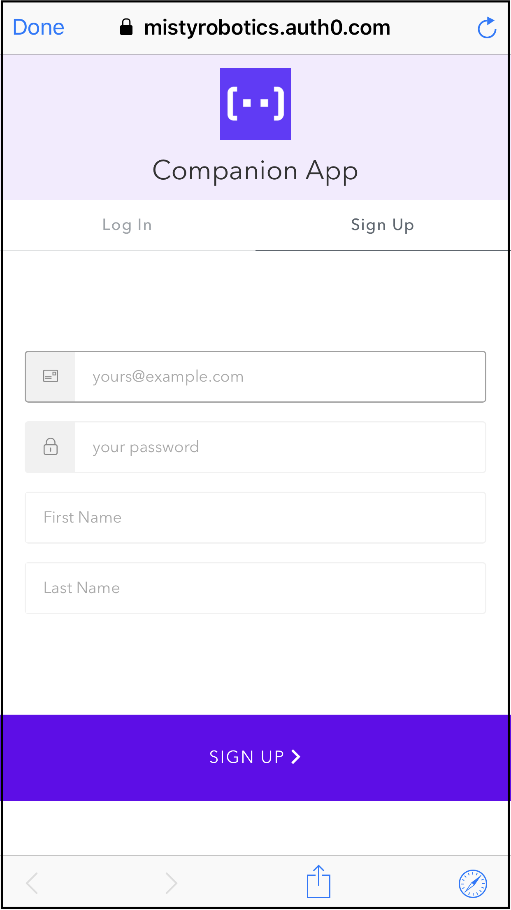
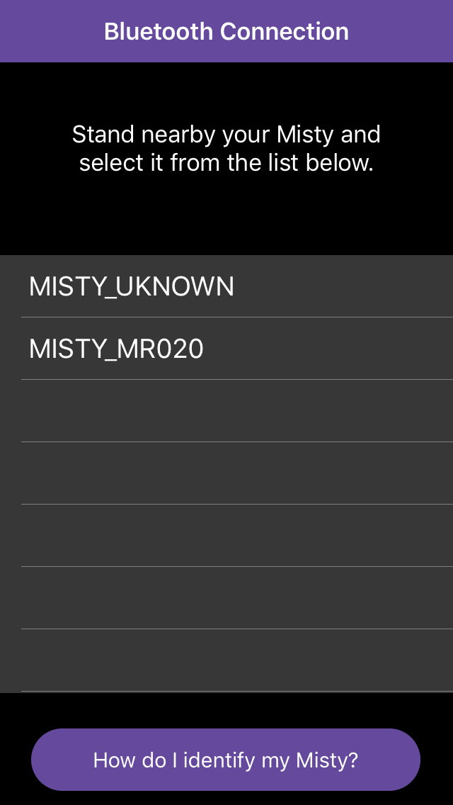
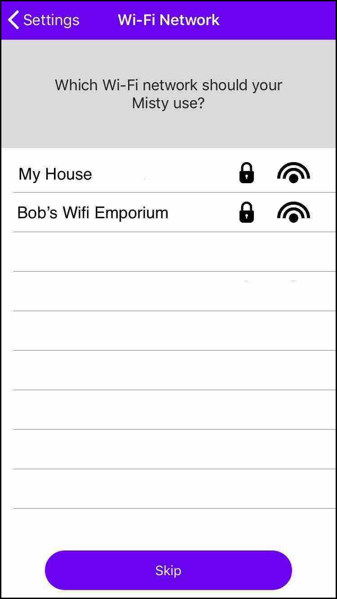
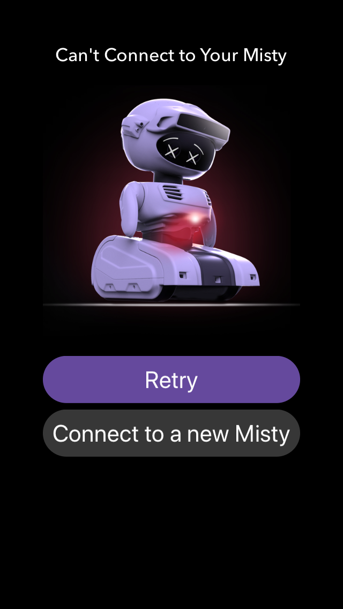
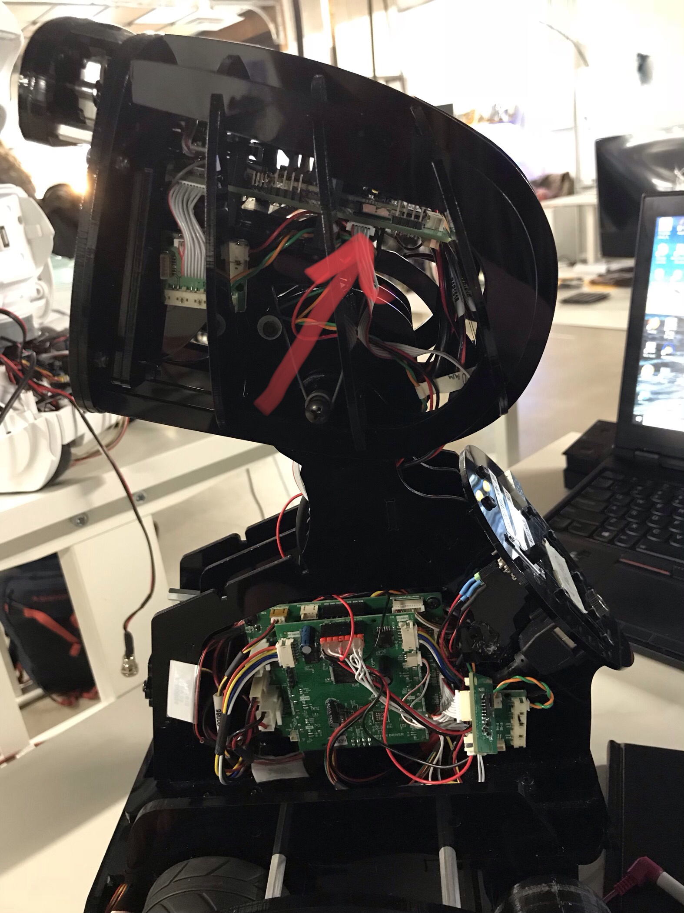
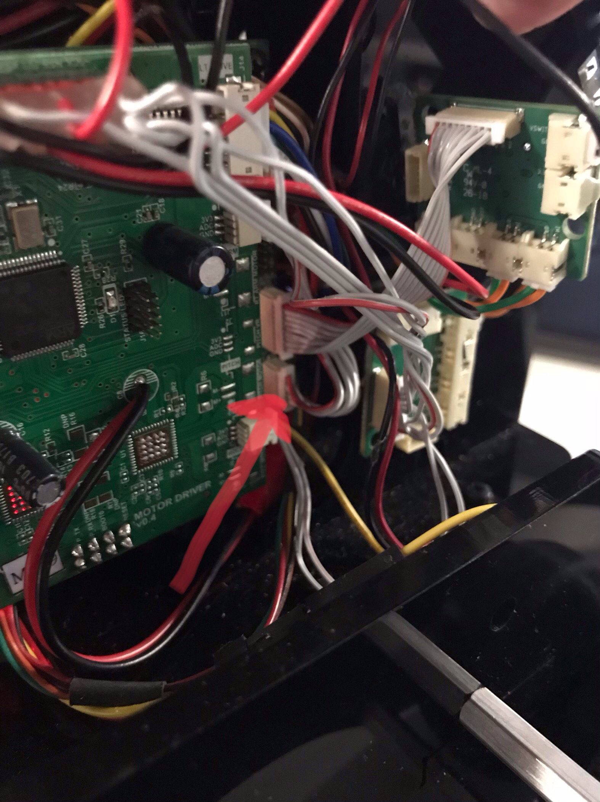
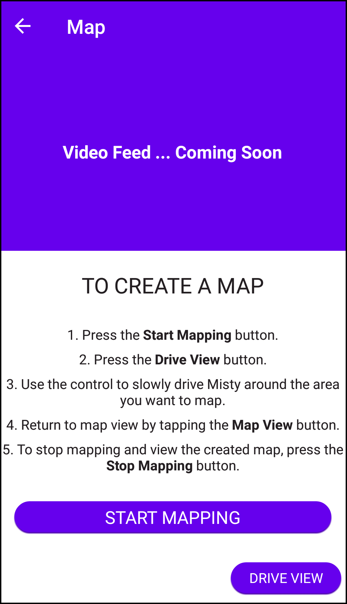
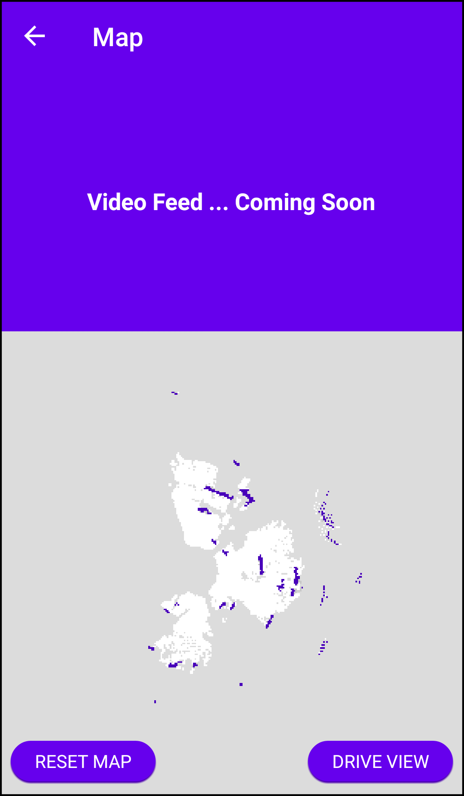

# {{title}}
The Misty Companion app allows you to set up Bluetooth and Wi-Fi connections to your robot. You can also check Misty's battery level, drive Misty and create maps.

You should receive an email inviting you to download the current version of the Misty Companion app, as well as email updates when new versions are available. Because the app is updated very frequently, it's good to check for new versions often.
 
**Note:** It's not generally recommended for multiple users to each use a separate instance of the Misty Companion app to connect and send commands to a single Misty robot. If more than one person does connect to Misty at the same time, as in a class or group development environment, they will need to take turns sending commands, or Misty may appear to respond unpredictably.

**Important!** When using the Misty Companion app, **make sure your phone and Misty are on the same Wi-Fi network**.

## Connecting Misty to Bluetooth and Wi-Fi
The Misty Companion app will ask you to connect to Bluetooth first, then Wi-Fi.

**Note: You can only connect Misty to Wi-Fi networks that have password protection.** Misty cannot be connected to open networks at this time. Misty does support both 2.4 GHz and 5 GHz Wi-Fi networks. If you are using a network without password protection or one that requires additional layers of authentication, see [this support thread](https://community.mistyrobotics.com/t/nontraditional-network-wifi-ideas/861) or contact us for help.

1. Power up your Misty robot and wait for her eyes to appear fully open.
2. Turn on Bluetooth on your phone or tablet and make sure your device is connected to your preferred Wi-Fi network.
3. Download the Misty Companion app. If you haven’t already received an email from HockeyApp or TestFlight with instructions on how to download the mobile app, please send a note to **help @ mistyrobotics.com** and let us know which app (iOS or Android) you prefer.
4. Open the Misty Companion app. Previous users may be asked to log in. New users will be asked to sign up for a new account.  
5. Once you've logged in, connect the app to Misty via Bluetooth by gently tapping or holding your device close to Misty when this screen appears. 
6. If the Bluetooth connection succeeds, the app displays a list of Wi-Fi networks. Select **the same network for Misty that your phone is connected to**, enter the password, and hit **Return**. You can only connect Misty to Wi-Fi networks that have password protection. 
7. If the Bluetooth or Wi-Fi connection fails initially or at any point when you are using the app, you'll see a screen that allows you to try reconnecting to Misty. If you cannot successfully connect Misty to Wi-Fi, check for and install any updates to the Companion App. 
8. Once the Wi-Fi connection succeeds, you should see the Misty Companion app **Home** screen. Confirm that the Wi-Fi status is **Connected** and that a valid IP address for Misty appears onscreen. **Note: You will need the IP address to use Misty with Blockly and the API Explorer.** 

**Important!** While it’s usually easiest to use the Companion App to connect Misty to your home WiFi network, sometimes there can be issues with this method. In that case, you can use the [API Explorer](../api-explorer/#connecting-wifi) and the USB-to-Ethernet adaptor that came with your robot to connect Misty instead.

## Getting Information about Misty
The **My Misty** screen provides information on Misty’s Bluetooth and Wi-Fi connections, her IP address, software versions, and more.

1. From the bottom of the **Home** screen, select the **My Misty** icon. **Important!** There is currently a known issue that can occur when initially connecting Misty and the Companion App. Even if the Companion App says it's connected to Misty, the robot's IP address and battery % may not display initially. Closing the app and repeating the connection process allows the app to display that data. 
2. The **My Misty** screen allows you to view connectivity, software, and hardware information. 

## Updating Misty
The **Settings** screen provides a way for you to easily start an update to Misty's system software. If you want to find the version information for your robot's currently installed system software, use the **My Misty** screen as described above. To find out the version number(s) for the most recent system updates, see the release notes on our [Community site](https://community.mistyrobotics.com/c/development/misty-I). 

**Important: Please keep Misty plugged in for the entire duration of the update and do not attempt to send commands to her during this time.**

1. Before updating Misty, make sure your robot is plugged into a power source. Your robot should stay connected to her charger until the update is complete.
2. To update Misty, select the **Settings** icon from the bottom of the **Home** screen. 
3. Press the words **Software Update** to start the update process. 
4. Because downloading and installing a system update may take from several minutes to an hour, you must confirm that you want to start the update process at this time. Press **Yes** to start the update process. **Note: During the download and update, Misty is still functional, however driving Misty is NOT recommended during this process.** 
5. The update process may take up to a half hour total. **The update is not complete until Misty restarts and her happy eyes re-appear.**  
6. Because updating Misty causes her to lose her Bluetooth connection, you must reconnect Misty to Bluetooth when her update is complete.
7. If your robot consistently fails to update, there may be a loose or faulty connection on Misty's headboard or real-time controller board. To check these connections, visually inspect the connectors on the headboard first, near the location indicated below.  Then check the connectors on the real-time controller board, indicated below. 
Please contact Misty's support team if the connections on either of these boards appear loose or broken.

## Driving Misty with the Companion App

1. From the **Home** screen, select the **Map/Drive** icon at the bottom of the screen. 
2. You should see a screen with instructions on creating a map. From this screen, you can either start mapping or driving your Misty robot. Press the **Drive View** button at the bottom of this instruction screen. 
3. On the driving control screen, you can see a speed slider control, a "joystick" directional control, and a +/- control (to move Misty's head up or down). Start Misty driving at a slower speed by moving the speed control left, toward the "tortoise". To speed up, move the control to the right, toward the "hare". 
5. Control the direction that Misty drives by moving one finger around the “joystick”. Pressing at the points at the top and bottom of the circle drives Misty straight forward or backward. Pressing in the areas to the left and right of the circle rotates Misty.

## Mapping with the Companion App

**Note:** If you are mapping with a **Misty I** or **Misty II prototype**, please be aware of the following:
* The USB cable connecting the headboard to the Occipital Structure Core depth sensor is known to fail in some Misty prototypes. This can cause intermittent or non-working mapping and localization functionality.
* Misty prototypes can only create and store one map at a time, and a map must be created in a single mapping session.
* Mapping a large room with many obstacles can consume all of the memory resources on the processor used for mapping and crash the device.
* Some Misty I and some Misty II prototypes may generate inaccurate maps due to depth sensor calibration flaws.

**Note:** It can be difficult to drive Misty manually and maintain the low speeds required for her to map an area without losing [pose](../api-explorer/#obtaining-pose). If you are unable to successfully map an area with the Companion App, you may be able to generate a map programmatically by coding Misty to very slowly explore an area.

1. From the **Home** screen, select the **Map/Drive** icon at the bottom of the screen. 
2. You should see a screen with instructions on creating a map. From this screen, you can either start mapping or driving your Misty robot. To create a map, begin by pressing the **Start Mapping** button. 
3. The **Start Mapping** button should change to **Stop Mapping** on the instruction screen. Press the **Drive View** button at the bottom of the screen. 
4. Use the driving controls to SLOWLY drive Misty around the area you want to map. 
5. When you want to see the progress of your map, press the **Map View** button at the bottom of the driving control screen.
6. Pressing **Map View** brings up the map screen, which displays the in-progress map. From this screen, you can press **Drive View** to continue filling in the map, or you can press **Reset Map** to clear the map and start over.
7. Once you have finished the map to your satisfaction, press the arrow at the top left of the drive or map screens to return to the instructions.
8. On the instructions screen, press **Stop Mapping** and view your completed map. 

