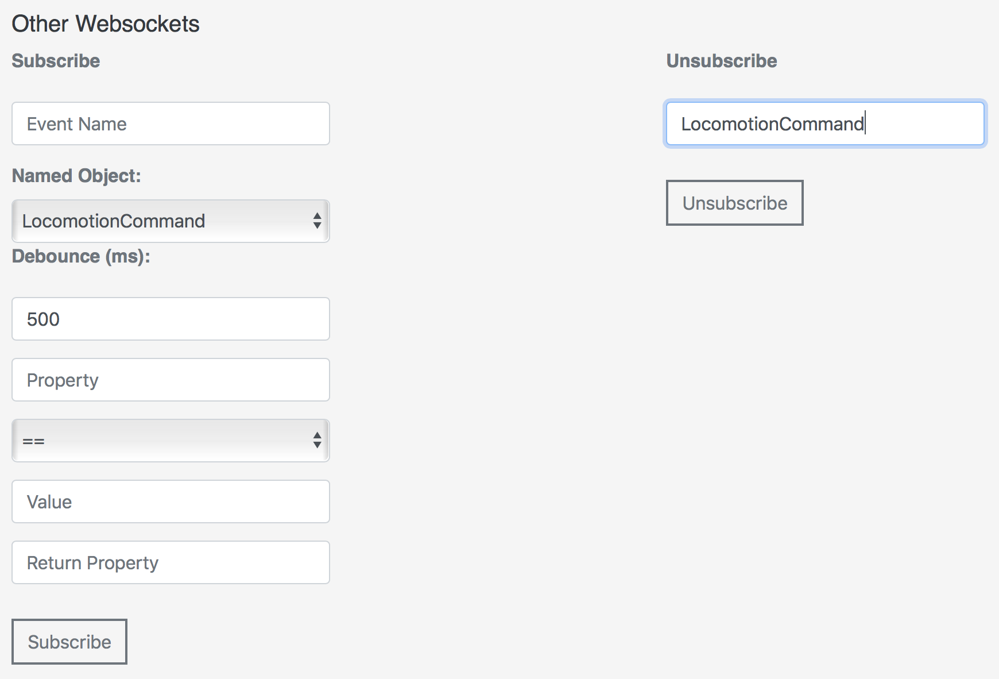
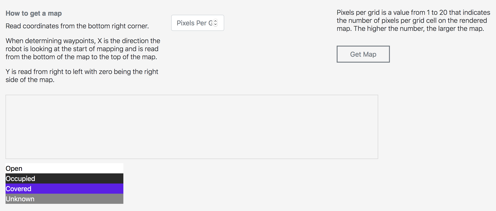

# {{title}}

When you use the API Explorer in your browser, you can use Misty's API endpoints to try Misty out, without writing any code. We recommend using the API Explorer with the following browsers: Safari, Chrome, Firefox, and Microsoft Edge (latest versions).

## Set up the API Explorer

As with the companion app and Blockly, when using the API Explorer, make sure your computer and Misty are on the same Wi-Fi network and using Bluetooth.

1. [Download the API Explorer](https://s3.amazonaws.com/docs.mistyrobotics.io/assets/files/Misty.API.zip). Unzip the download and open the index.html file into your browser. You should see the API Explorer looking like the screenshot above.
2. Get the IP address of your robot from the Info tab of the companion app. Enter that IP address and hit the **Connect** button.
3. Confirm the browser is connected to your robot via its IP address:
    * Open your browser’s JavaScript console. (How you do this will vary among browsers and platforms.)
    * Click **Get Device Information** in the API Explorer.
    * You should see information relevant to your robot (such as the IP address) in the browser console. This confirms you’re connected.
4. Select the amount of console messages you’ll receive by setting the console log level (0-3). Selecting 3 will give you a console message for each method in all 3 classes, for example. The console messages can be really helpful when getting started.
5. Experiment with Misty’s eyes, LED color, sounds, and movement.

## Face Recognition with the API Explorer - BETA

Misty's ability to recognize faces is under development. To try face training and recognition, follow these steps.

1. If you are using Misty 1 Beta version, make sure the 820 Dev Kit board mounted on Misty’s right side is on.
2. Make sure that the light on Misty’s HD camera (located above her eyes on Misty I Beta) is solid blue.
3. Connect to Misty from the API Explorer using the setup instructions above.
4. Scroll down to the **Misty Alpha & Beta Commands** section of the API Explorer and click **I understand...** if you have not already done so. Clicking "I understand..." indicates that you are aware that Misty's Alpha and Beta features are currently not complete and may not function as intended.  
5. In the **Misty Beta Commands** section, go to **Computer Vision** and enter a name in the **Face Training** input box. 
6. Position the person’s face in a well-lit area about a foot or two away from Misty’s camera.
7. Click **Start Face Training** and wait 10-15 seconds. (There is no need to click **Cancel Face Training**, unless you want to stop the process before it completes.)
8. Scroll up the API Explorer page to the **Websockets** section and click the **Open Websocket** button. 
9. In the **Other Websockets** section, find the **Subscribe** controls. Under **Named Object**, select **FaceRecognition**, then click **Subscribe**. 
10. Scroll back down to the **Computer Vision** section of the API Explorer and click **Start Face Recognition**. 
11. Position the person’s face in a well-lit area front of the camera.
12. Watch the browser console for face information to come through.
13. When finished, scroll back up to the **Other Websockets** section and find the **Unsubscribe** controls. Enter "FaceRecognition" in the Event Name field and click **Unsubscribe**. 

## Mapping & Tracking with the API Explorer - ALPHA

For best control, we recommend that mapping be done at this time via the API Explorer instead of with Blockly or the companion app.

**Note: The software that runs the Occipital sensor for mapping is alpha. Experiment with mapping, but recognize that it is unreliable at this time.**

### Mapping
1. If you are using Misty 1 Beta version, make sure the 820 Dev Kit board mounted on Misty’s right side is on.
2. Connect to Misty from the API Explorer using the setup instructions above.
3. Scroll down the API Explorer page to the **Websockets** section and click the **Open Websocket** button. 
4. Scroll down to the **Misty Alpha & Beta Commands** section of the API Explorer and click **I understand...** if you have not already done so. Clicking "I understand..." indicates that you are aware that Misty's Alpha and Beta features are currently not complete and may not function as intended.  
5. Scroll down to **Misty Alpha Commands** and find the **Mapping and Exploring** section. 
6. Click **Get Status** and observe the bottom of the page for a status message to pop up. If Misty's status is other than ready, click **Reset**, then click **Get Status** again. If Misty's status does not return as ready after multiple **Reset** and **Get Status** commands, restart Misty, confirm the 820 board is on, and try again.
7. Click **Start Mapping**. After a few seconds, the **Pose** light should turn green. Having pose means Misty knows her location and orientation on the map, in X,Y coordinates.
8. Observe the **Pose X** and **Pose Y** fields for data. If you do not see pose updates, it is possible the lighting is too low for Misty. Note also that the Pose fields may not contain data until Misty starts moving.
9. Select one of the drive options (**Turn in Circle**, etc.) or drive Misty yourself. When mapping, it is ideal if Misty moves SLOWLY around a small space (start with an area no more than 20’ x 20’). Verify that the Pose fields contain data that updates as Misty moves.
10. When done driving, click **Stop Mapping**.
11. Scroll down to the **Map** section and click **Get Map**. 

### Mapping Tips
Having mapping issues? Try these tips:

* If you do not see pose data updating, it is possible the lighting is too low for Misty.
* Verify that the mapping sensors are working. The Occipital laser near Misty’s right eye should be glowing blue.
* Drive slowly to give the mapping system the best chance to fill in all details. Slowing Misty down increases mapping effectiveness.
* Make wider turns (in arcs) to improve mapping results.
* If Misty loses pose after generating a map, she will need to generate a new map and start over.
* Every time you create a new map, the former map is deleted. You can use the API to get a map and back it up, if desired.
* Mapping coordinates are currently inverted (X is vertical, Y is horizontal).
* Confirm that Misty has not lost her Wi-Fi or Bluetooth connection while mapping. To do this, open Misty's companion app. If she has lost Bluetooth, the two dots disappear from the companion app’s Bluetooth icon. If she has lost her connection, close the companion app and restart it, then reconnect as before.

### Tracking
1. Once you have successfully generated a map, click **Start Tracking** and begin driving Misty. Activating tracking should provide data in the Pose fields for where Misty is on the map you generated.
2. Observe the Pose fields as Misty moves to ensure she is successfully tracking. If the Pose data stops while Misty is moving, try backing Misty up for one second. Misty may find her way again.
3. Click **Stop Tracking**.

## Ready for more?
* Reference the `Misty.API` classes in your HTML:
    * `MistyAjax.js` - Sends AJAX calls to Misty.
    * `MistyAPI.js` - Maps one-to-one to Misty's API endpoints and constructs payloads to pass to `MistyAJAX.js`. You can call it directly once you have created a new `MistyRobot` by inputting the robot's IP address, port, and verbose level.
    * `MistyRobot.js` - Builds the server URL based on the robot you are attempting to interact with and provides a wider and more user-friendly range of commands than `MistyAPI.js`.
* Use `SampleUI.js` to see examples of all of the event listeners linked to the various buttons rendered in index.html. For example, Select a mood or Change LED.
