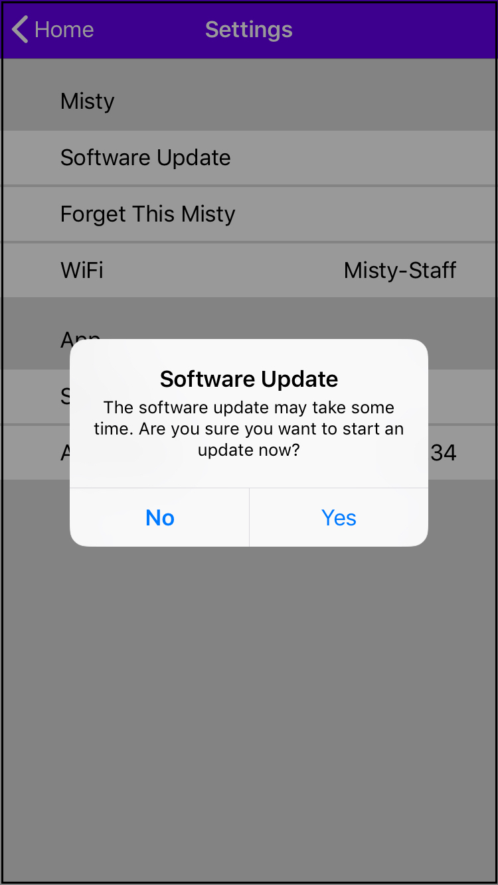
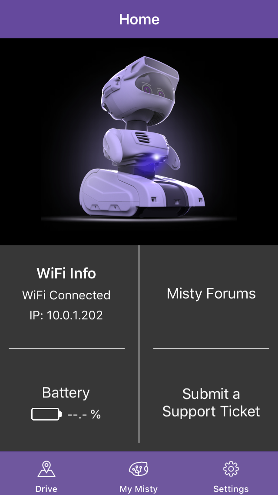
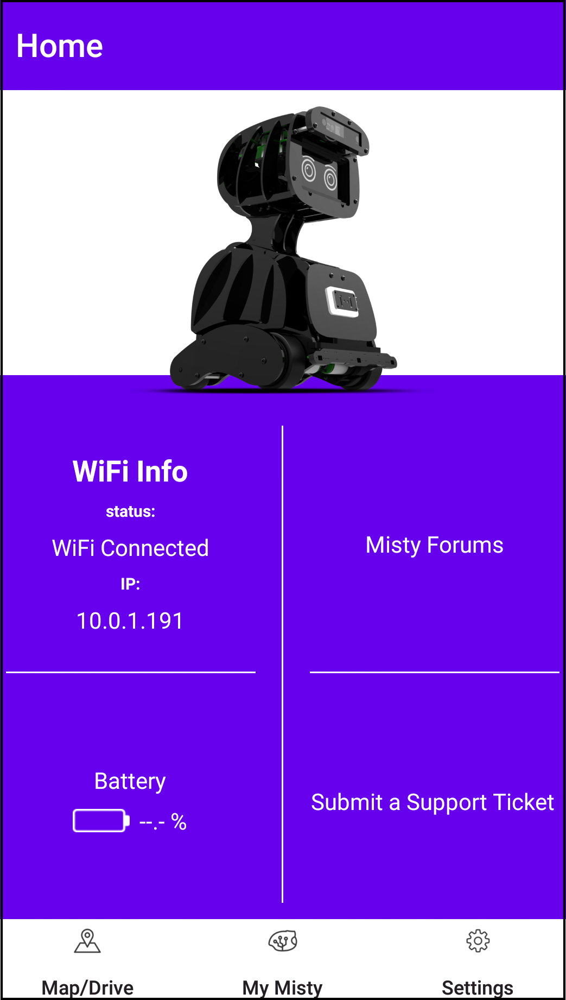
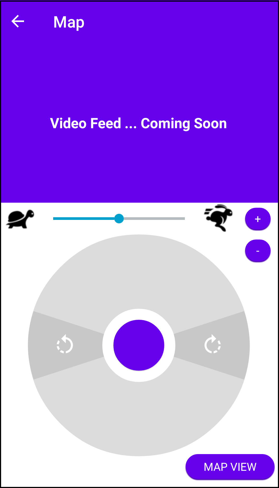

# {{title}}
The Misty Companion app allows you to set up Bluetooth and Wi-Fi connections to your robot. You can also check Misty's battery level, drive Misty and create maps.
 
**Note:** It's not generally recommended for multiple users to each use a separate instance of the Misty Companion app to connect and send commands to a single Misty robot. If more than one person does connect to Misty at the same time, as in a class or group development environment, they will need to take turns sending commands, or Misty may appear to respond unpredictably.

**Important!** When using the companion app, you should connect Misty to **both** Bluetooth and Wi-Fi. Keep reading for connection instructions.

## Connecting Misty to Bluetooth and Wi-Fi
The Misty Companion app will ask you to connect to Bluetooth first, then Wi-Fi. Note that Misty supports both 2.4 GHz and 5 GHz Wi-Fi networks.

1. [Power up](/onboarding/get-started/powering-up-down) your Misty robot and wait for her eyes to appear.
2. Turn on Bluetooth on your phone or tablet and make sure your device is connected to your preferred Wi-Fi network.
3. Download the Misty Companion app. If you haven’t already received an email from HockeyApp or TestFlight with instructions on how to download the mobile app, please send a note to **help @ mistyrobotics.com** and let us know which app (iOS or Android) you prefer.
4. Open the Misty Companion app and log in or sign up for a new account.  
5. Once you've logged in, connect the app to Misty via Bluetooth by gently tapping or holding your device close to Misty when this screen appears. 
6. If the Bluetooth connection succeeds, the app displays a list of Wi-Fi networks. Select the same network for Misty that your phone is currently connected to, enter the password, and hit **Return**. 
7. If the Bluetooth or Wi-Fi connection fails initially or at any point when you are using the app, you'll see a screen that allows you to try reconnecting to Misty. 
8. Once the Wi-Fi connection succeeds, you should see the Misty Companion app **Home** screen. Confirm that the Wi-Fi status is **Connected** and that a valid IP address for Misty appears onscreen. **Note: You will need the IP address to use Misty with Blockly and the API Explorer.** 

## Getting Information about Misty
The **My Misty** screen provides information on Misty’s Bluetooth and Wi-Fi connections, her IP address, software versions, and more.

1. From the bottom of the **Home** screen, select the **My Misty** icon. 
2. The **My Misty** screen allows you to view connectivity, software, and hardware information. 

## Updating Misty
The **Settings** screen provides a way for you to easily start an update to Misty's system software.

Alternately, you can use the [API Explorer](/onboarding/3-ways-to-interact-with-misty/api-explorer/#system-updates) to start an over-the-air (OTA) system update or you can perform a [manual update](/onboarding/get-started/system-updates). **Note: The manual update process is not typically recommended, but is available if needed.**

1. Before updating Misty, make sure your robot is plugged into a power source.
2. To update Misty, select the **Settings** icon from the bottom of the **Home** screen. 
3. Press the words **Software Update** to start the update process. 
4. Because downloading and installing a system update may take from several minutes to an hour, you must confirm that you want to start the update process at this time. Press **Yes** to start the update process. **Note: During the download and update, Misty is still functional, however driving Misty is NOT recommended during this process.** 
5. Because updating Misty causes her to lose her Bluetooth connection, you will need to reconnect Misty to Bluetooth when her update is complete.

## Driving Misty with the Companion App

1. From the **Home** screen, select the **Map/Drive** icon at the bottom of the screen. 
2. You should see a screen with instructions on creating a map. From this screen, you can either start mapping or driving your Misty robot. Press the **Drive View** button at the bottom of this instruction screen. 
3. On the driving control screen, you can see a speed slider control, a "joystick" directional control, and a +/- control (to move Misty's head up or down). Start Misty driving at a slower speed by moving the speed control left, toward the "tortoise". To speed up, move the control to the right, toward the "hare". 
5. Control the direction that Misty drives by moving one finger around the “joystick”. Pressing at the points at the top and bottom of the circle drives Misty straight forward or backward. Pressing in the areas to the left and right of the circle rotates Misty.

## Mapping with the Companion App

1. From the **Home** screen, select the **Map/Drive** icon at the bottom of the screen. 
2. You should see a screen with instructions on creating a map. From this screen, you can either start mapping or driving your Misty robot. To create a map, begin by pressing the **Start Mapping** button. 
3. The **Start Mapping** button should change to **Stop Mapping** on the instruction screen. Press the **Drive View** button at the bottom of the screen. 
4. Use the driving controls to SLOWLY drive Misty around the area you want to map. 
5. When you want to see the progress of your map, press the **Map View** button at the bottom of the driving control screen.
6. Pressing **Map View** brings up the map screen, which displays the in-progress map. From this screen, you can press **Drive View** to continue filling in the map, or you can press **Reset Map** to clear the map and start over.
7. Once you have finished the map to your satisfaction, press the arrow at the top left of the drive or map screens to return to the instructions.
8. On the instructions screen, press **Stop Mapping** and view your completed map. 

