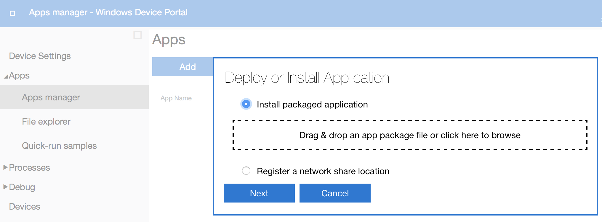
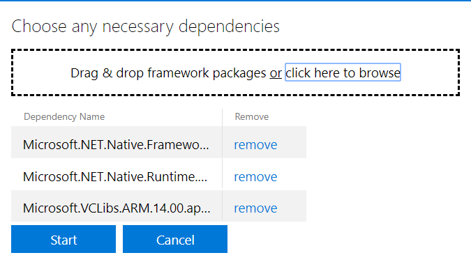
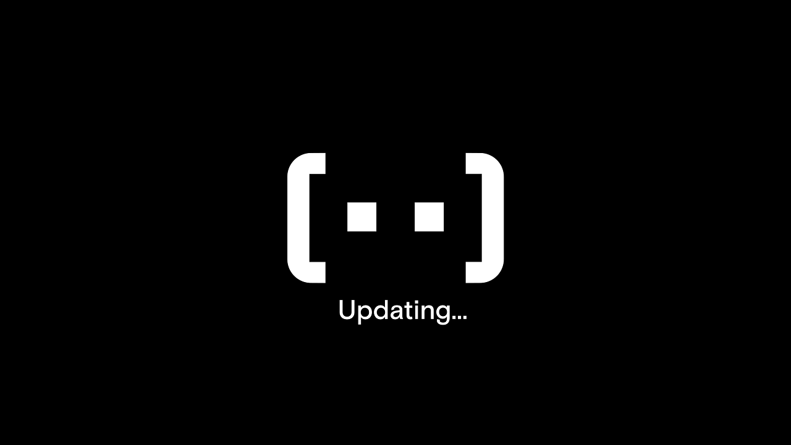

# {{title}}

In general we recommend that you perform OTA (over the air) updates for Misty, using the [Misty Companion app](../../3-ways-to-interact-with-misty/companion-app/#updating-misty) or [API Explorer](../../3-ways-to-interact-with-misty/api-explorer/#system-updates). However, **if you have issues after attempting an OTA update, you can try the following manual update steps.**

Updates can include:

* Image and/or sound assets
* Motor controller firmware
* Real-time controller firmware 
* Occipital Structure Core depth sensor firmware
* Home Robot application (running on Windows IoT Core)
* Sensory Services application (running on Android)
* OS updates

## Manually Updating Misty
You can follow along with these instructions while watching our [Manual Update Process video](https://www.youtube.com/watch?v=nXIJBvbnrtI).

1. Plug Misty into the charger.
2. Turn on Misty’s main power switch on her back.
3. Download the update package zip file.
4. Open the zip file (`Manual-Update.zip`) and save the `Manual Update` directory to a location on your computer.
5. Run the update package:
   * **Windows:** Right-click on `stage-firmware-update.ps1` and click **Run with Powershell**.
   * **Mac/Linux:** Run the `stage-firmware-update.sh` script in a terminal program.
6. When prompted, enter the IP address of your robot to upload the update configuration file to Misty. You can obtain the IP address of your robot from the [Misty Companion app.](../../3-ways-to-interact-with-misty/companion-app/#getting-information-about-misty) **Note: If the upload script does not complete, you can copy the file manually, as follows:**
   * **Windows:** Use the File Explorer to navigate to the `C` directory of your robot: `\\<ip of your robot>\c$` . (If you need to log in to Misty, the default Windows IoT Core username is *administrator* and the default password is *p@ssw0rd* .) Copy the `versions.xml` file from the `Manual Update` directory to `\\<ip of your robot>\c$\Data\Users\DefaultAccount\Documents` .
   * **Mac/Linux:** In a browser window, go to `http://<ip of your robot>:8080/#File%20explorer` to view the Windows Device Portal File explorer. (If you need to log in to Misty, the default Windows IoT Core username is *administrator* and the default password is *p@ssw0rd* .) In the File explorer, select the `Documents` directory and click the **Upload** button. Navigate on your computer to the `Manual Update` directory you extracted; select and upload the `versions.xml` file. 
7. Open a browser window and navigate to the Windows Device Portal at `http://<ip of your robot>:8080`  If you need to log in to Misty, the default Windows IoT Core username is *administrator* and the default password is *p@ssw0rd* . 
8. Expand the **Apps** tab on the left side of the page and select **Apps manager**.
9. In the **Apps manager** pane, click **Add**. 
10. Under **Install packaged application**, click the phrase **click here to browse**. 
11. Browse and select the `.appxbundle` file in the `Home Robot App` directory of the `Manual Update` directory.
12. When given the option, check the **I want to specify framework packages** checkbox. 
13. Click **Next**.
14. Under **Choose any necessary dependencies**, click the phrase **click here to browse** and select the 3 .appx files in the `Dependencies` directory of the `Home Robot App` directory. 
15. Click **Start** to begin the installation. This process may take several minutes.
16. Once the installation is complete, click the **Startup** radio button for `Misty 1 Home Robot` to set it as the startup application. 
17. Watch Misty while you wait for the Misty Home Robot app to start up. The Misty Robotics logo will appear, and Misty's eyes may briefly display before they are replaced by an **Updating...** image. Misty may twitch while performing the firmware update. **Note: The update process may take up to a half hour.** 
18. If the update is successful, Misty plays a cheerful sound and her eyes appear happy for two seconds, before changing back to their default appearance. Also, with a successful update, the blue LED connector light on the front-right side of Misty's head should come on. If the blue connector light does not come on, or if Misty plays a sad sound and her eyes appear sad for two seconds, the update has failed. **Note: If the update fails, pleaes reach out for assistance on any of the Misty Robotics support channels.**
19. If the release you're installing includes updates to the Occipital Structure Core firmware: Connect to the [API Explorer](../../3-ways-to-interact-with-misty/api-explorer) and issue a [Start Mapping](../../3-ways-to-interact-with-misty/api-explorer/#mapping-alpha) command. This allows the firmware to be picked up by the Occipital Structure Core depth sensor.

